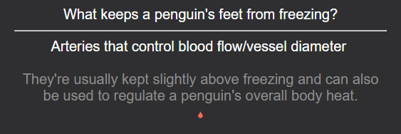
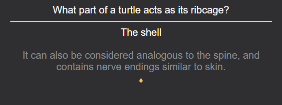
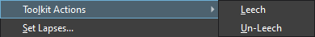
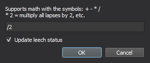
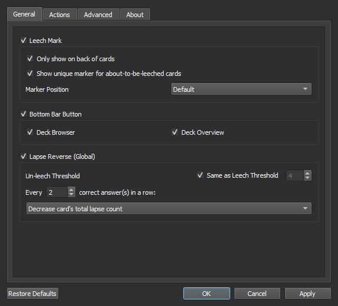
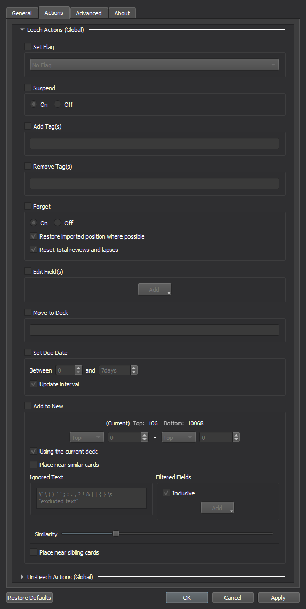
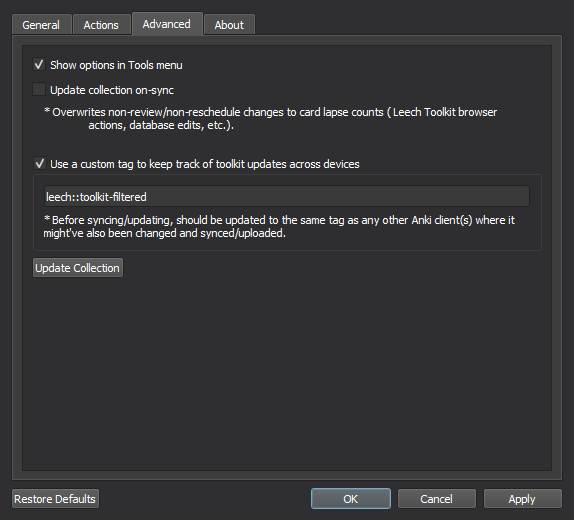
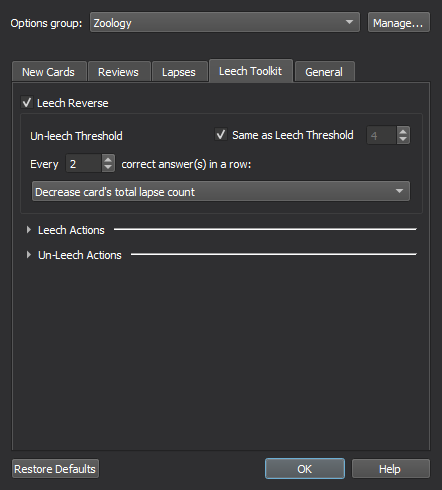

# 
Leech Toolkit 🩸

Add additional tools and functionality for handling leeches in Anki!

## Installation

Install from [Anki-Web](https://ankiweb.net/shared/info/@addon_id)  
Or go to "Tools -> Add-ons -> Get Add-ons..." and paste these numbers in:
> @addon_id

## Features

#### Leech Marker

###### Show a marker on cards that have been leeched.

#### Almost-Leech Marker

###### Show a marker on cards that are about to be leeched.

#### Bottom Bar Leech Button

###### Add a button to Anki's bottom bar whenever a leeches exist in decks.

#### Lapse & Leech Reverse

##### Lapse Reverse

###### Decrease or reset card lapses after a custom number of correct answers in a row.

##### Revert/Un-Leech Cards

###### Revert leeched cards when their lapse count gets below a custom threshold.

#### Custom Actions on Leech/Reverted Leech

###### An array of actions that can be customized to do a number of different things, automatically!

###### (More details under [Options > Actions](#actions))

#### Update Lapses and Leech Status Across Devices

<h6> 
Sync reviews/performance with AnkiWeb and add a custom tag to leech cards 
(doesn't replace the default tag) that gets saved across devices. 
</h6>

#### New Browser Menu Options

###### New options for leeching, un-leeching, and setting lapses on cards!

##### Leech/Un-leech

###### Leech/Un-leech cards and perform custom actions based on the per-deck/global settings per card.

##### Set Lapses

###### Set lapse counts on cards and (optionally) update their leech status based on the new lapse count.

#### Reviewer Shortcuts

##### Extra shortcuts to leech/un-leech cards during reviews

######  

## Options

###### @Blurb

### General

###### @Blurb

### Actions

###### @Blurb

### Advanced

###### @Blurb

### Deck Options

###### @Blurb

## Text Macros

###### @Blurb

#### Bugs/Issues:

Please post any issues or feedback you might have on [GitHub](https://github.com/iamjustkoi/LeechToolkit/issues).
  

Happy studies! -koi

MIT License ©2022 JustKoi (iamjustkoi)
