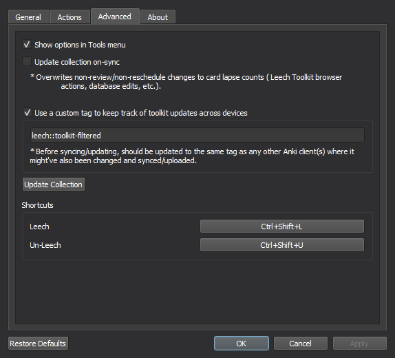

# 
Leech Toolkit 

Add additional tools and functionality for handling leeches in Anki!

## Installation

Install from [Anki-Web](https://ankiweb.net/shared/info/368380974)  
Or go to "Tools -> Add-ons -> Get Add-ons..." and paste these numbers in:
> 368380974

## Features

#### Leech Marker

###### Show a marker on cards that have been leeched.

#### Almost-Leech Marker

###### Show a marker on cards that are about to be leeched.

#### Bottom Bar Leech Button

###### Add a button to Anki's bottom bar whenever a leeches exist in decks.

#### Lapse & Leech Reverse

##### Lapse Reverse

###### Decrease or reset card lapses after a custom number of correct answers in a row.

##### Revert/Un-Leech Cards

###### Revert leeched cards when their lapse count gets below a custom threshold.

#### Custom Actions on Leech/Reverted Leech

###### An array of actions that can be customized to do a number of different things, automatically!

###### (More details under [Options > Actions](#actions))

#### Update Lapses and Leech Status Across Devices

<h6> 
Sync reviews/performance with AnkiWeb and add a custom tag to leech cards 
(doesn't replace the default tag) that gets saved across devices. 
</h6>

#### New Browser Menu Options

###### New options for leeching, un-leeching, and setting lapses on cards!

##### Leech/Un-leech

###### Leech/Un-leech cards and perform custom actions based on the per-deck/global settings per card.

##### Set Lapses

###### Set lapse counts on cards and (optionally) update their leech status based on the new lapse count.

#### Reviewer Shortcuts

##### Customizable shortcuts to leech/un-leech cards during reviews

## Options

### General

###### General options for UI elements and Lapse Reversing.

### Actions

###### Optional leech/un-leech actions that can also override base Anki operations.

- `Set Flag` - set the current flag
- `Suspend` - set suspended state to on/off
- `Add Tag(s)` - add tags (with optional text macros see: [Text Macros](#text-macros))
- `Remove Tag(s)` - remove tags (with optional text macros see: [Text Macros](#text-macros))
- `Forget` - forget the card and restore its initial state
- `Edit Field(s)` - append, prepend, and/or replace text to note fields
    - 

        
Example
    
          
        

- `Move to Deck` - move the card to a specified deck
- `Set Due Date` - reschedule the card between a range of days
- `Add to New` - Add a card to the new queue with some custom match filters
    - 

        
Example
    
          
        

### Advanced

###### Options for hiding the config shortcut, syncing and updating the collection, and setting shortcuts.

### Deck Options

###### Custom settings, per-deck, for updating lapses and performing custom leech/un-leech actions.

###### These can be accessed in the legacy deck options menu (Shift + Options).

## Text Macros

###### Custom macros that can be accessed inside tag and field edits.

###### Also comes with some auto-complete features to see what can be used in a text box.

#### Available Macros:

- `%date` - the current date based on the system's locale (e.g. `2022-10-01`)
- `%reviews` - the review count for the current card (e.g. `3`)
- `%re:` - [Regular Expressions](https://learnxinyminutes.com/docs/pcre/)
    - Example Syntax:
        - `%re:captured_expression`
        - `%re:".*captured with spaces\W"`
        - `%re:\d\d\d\d-\d\d-\d\d` (capturing the above date format)
- `%%` - single % (e.g. `%%reviews` outputs `%reviews` instead of applying the macro)

#### Bugs/Issues:

Please post any issues or feedback you might have on [GitHub](https://github.com/iamjustkoi/LeechToolkit/issues).
  

Happy studies! -koi

MIT License ©2022 JustKoi (iamjustkoi)
